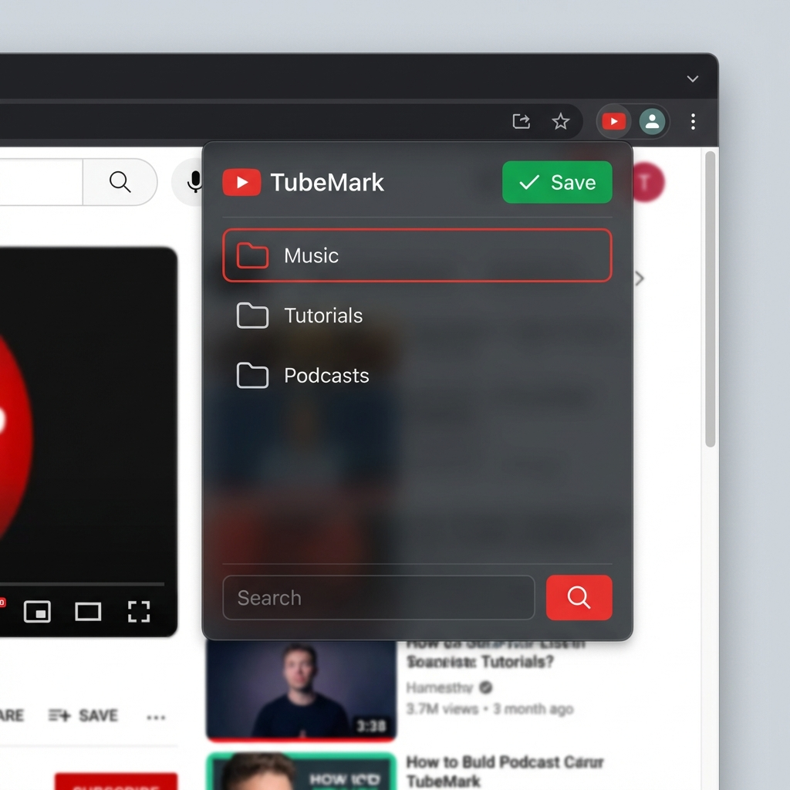

# TubeMark - YouTube Timestamp Manager


**TubeMark** is a powerful Chrome Extension that allows you to bookmark specific timestamps in YouTube videos and organize them into custom folders. Never lose a key moment again!



## Features

- **Save Timestamps**: Instantly save the current video time with a single click.
- **Folder Organization**: Categorize your clips into folders (e.g., "Music", "Tutorials", "Funny").
- **Smart Integration**:
  - **Injected Save Button**: A "Save" button appears directly in the YouTube player interface.
  - **Popup Action**: Save directly from the extension icon popup with folder selection support.
- **Local Storage**: All data is stored locally on your device for privacy and speed (`chrome.storage.local`).
- **Modern UI**: Sleek dark mode design with glassmorphism effects.

## Installation

### From Source (Developer Mode)

1.  Clone this repository or download the ZIP.
    ```bash
    git clone https://github.com/Muhammad-Hassan-X/TubeMark.git
    ```
2.  Open your browser (Chrome, Brave, Arc, Edge).
3.  Navigate to `chrome://extensions` (or `brave://extensions`, `arc://extensions`).
4.  Enable **Developer mode** in the top-right corner.
5.  Click **Load unpacked**.
6.  Select the folder where you cloned/downloaded **TubeMark**.

## Usage

1.  **Open YouTube**: Watch any video.
2.  **Save Moment**:
    *   Click the **Red Save Button** below the video player.
    *   OR click the **TubeMark Extension Icon** > **Save**.
3.  **Choose Folder**: A modal will pop up ask asking where to save the clip. Select a folder and confirm.
4.  **View Saved Clips**: Open the extension popup to browse your folders and saved timestamps. Click any clip to open it exactly at that moment!

## Browser Support

- Google Chrome
- Brave Browser
- Arc Browser
- Microsoft Edge
- Any Chromium-based browser

## License

MIT License. Free to use and modify!
